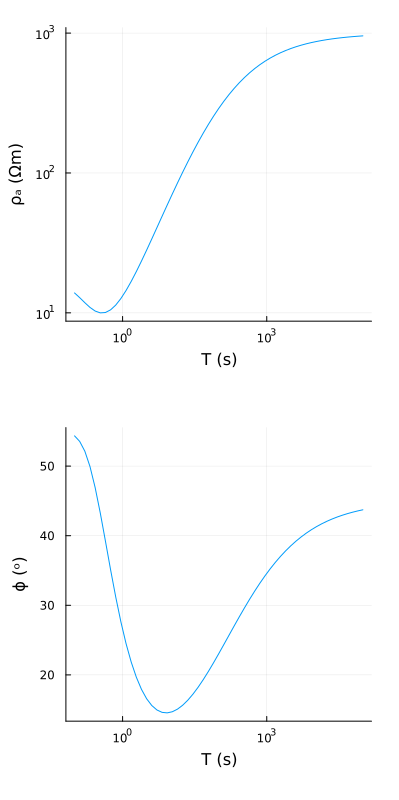
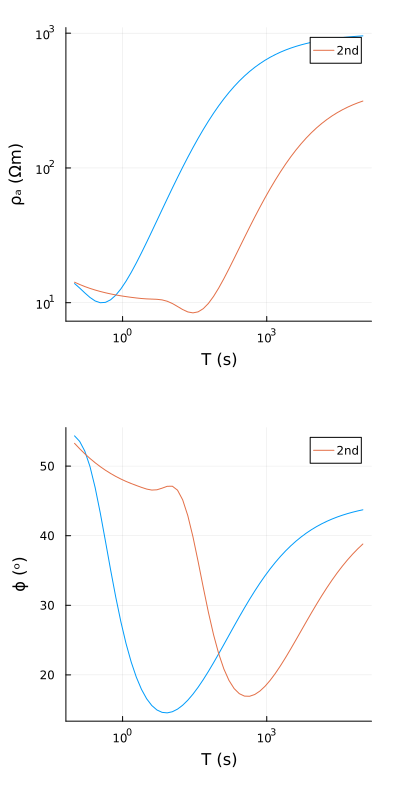

# Forward modeling

## Demo
Currently, only the recursion solution for MT forward modeling is supported. Once a model is defined, we can get the estimate as:

```julia
using MT
ρ= [500., 100., 400., 1000.];
h= [100., 1000., 10000.];
m= model(ρ, h)

T= 10 .^(range(-1,5,length= 57));
ω= 2π./T;

resp= forward(m, ω)
```

## Plots
Since MT `response` has two fields, and we also want to see the curves for other `model`s, usually for inversion, it's easier to create a wrapper and then plot them.
```julia
plt= prepare_plot(resp, ω)
plot_response(plt, margin= 5Plots.mm)
```


Another `response` can be overlain using:
```julia
ρ= [100., 10., 400.];
h= [100., 10000.];
m2= model(ρ, h)
resp2= forward(m2, ω)
prepare_plot!(plt, resp2, ω, label="2nd")
plot_response(plt, margin= 5Plots.mm)
```


## Benchmark

In-place operations for fast non-allocating computations are also supported. These would greatly speed up the inverse processes.

```julia
using BenchmarkTools
@benchmark forward!(resp, m, ω)
```
```
BenchmarkTools.Trial: 10000 samples with 1 evaluation.
 Range (min … max):  25.875 μs … 119.209 μs  ┊ GC (min … max): 0.00% … 0.00%
 Time  (median):     28.209 μs               ┊ GC (median):    0.00%
 Time  (mean ± σ):   28.593 μs ±   2.166 μs  ┊ GC (mean ± σ):  0.00% ± 0.00%

      ▂▄▅▅▅▆█▇▃▃▅▄▁▁▂▂▁                                        ▂
  ▂▂▄▆█████████████████▇▇██▇▇▇▇▇█▇█▆▅▆▆▆▅▅▅▄▄▂▃▄▄▄▄▅▅▄▄▅▃▄▄▅▄▅ █
  25.9 μs       Histogram: log(frequency) by time      38.9 μs <

 Memory estimate: 0 bytes, allocs estimate: 0.
```
The above benchmark was done on Mac M1.