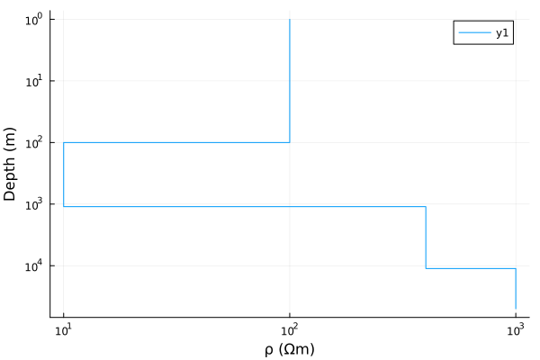
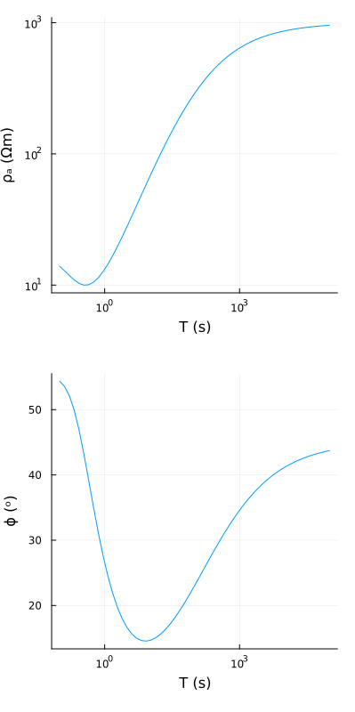
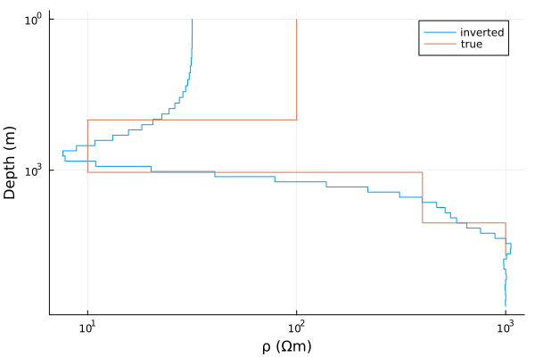
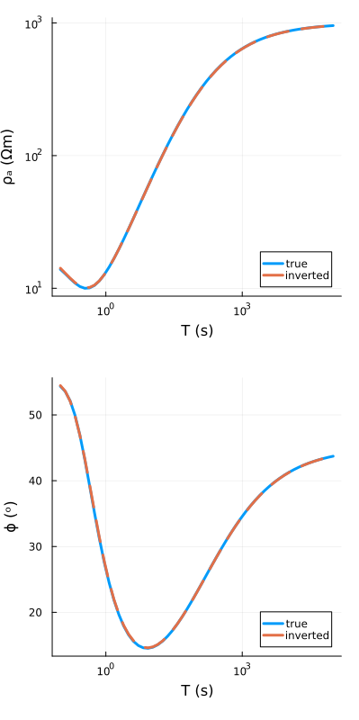

# Inversion

## Brief introduction
Inverse problems in geophysics are notoriously ill-posed with non-unique solutions. MT inversion is no different. Occam inversion is one of the most popular inversion algorithms to approach MT problems, and it comes with its own challenges. Not much to argue when dealing with compiling fortran codes and even less when one realizes that the Occam code doesn't work very well on Mac chips (not sure about AMD ones). Here we have the Occam inversion code on a test synthetic dataset, as easy as it can be. 

## Demo
We start with defining models:

```julia
using MT

ρ= [100., 10., 400., 1000.];
h= [100., 1000., 10000.];
m= model(ρ, h)

T= 10 .^(range(-1,5,length= 57));
ω= 2π./T;

plot_model(m)
```

and getting data.
```julia
resp= forward(m, ω);

plt= prepare_plot(resp, ω, label= false)
plot_response(plt);
```


One can add errors and everything but here we just put up a simple example.
```julia
h_test= 10 .^range(0., 5., length= 50);
ρ_test= 5e2 .*ones(length(h_test)+1);

m_test= model(ρ_test, h_test);
```

Now showtime, summon Occam.

```julia
inverse!(m_test, resp, ω, Occam(), max_iters= 50)
```
```
1: golden section search: μ= 999999.999995694, χ²= 200.26791686366522
2: golden section search: μ= 0.025598032468516288, χ²= 117.94687757631782
3: golden section search: μ= 0.8915068964606243, χ²= 102.33424310396764
4: golden section search: μ= 3.9154303744931647, χ²= 84.31796079643983
5: golden section search: μ= 14.451635169446117, χ²= 68.54602019792415
6: golden section search: μ= 20.9491782695287, χ²= 57.19116304832081
7: golden section search: μ= 21.30415636472845, χ²= 47.07124355734894
8: golden section search: μ= 19.380301764336227, χ²= 38.90702204073613
9: golden section search: μ= 14.52074922256054, χ²= 31.896351665323248
10: golden section search: μ= 9.887109962722333, χ²= 25.947153222835635
11: golden section search: μ= 6.125396578348698, χ²= 20.92365843845131
12: golden section search: μ= 3.3488669014086807, χ²= 16.72086271067389
13: golden section search: μ= 1.5044732572995267, χ²= 13.255302043214376
14: golden section search: μ= 0.6178120241561886, χ²= 10.442883965148926
15: golden section search: μ= 0.47974961310153835, χ²= 8.19508913060536
16: golden section search: μ= 0.44343917820714096, χ²= 6.421742973403228
17: golden section search: μ= 0.6373297387397355, χ²= 5.017532676122696
18: golden section search: μ= 0.6097277485481956, χ²= 3.903713051874287
19: golden section search: μ= 0.6374799280772572, χ²= 3.0341425479427437
20: golden section search: μ= 0.6608335882951886, χ²= 2.354915085807794
21: golden section search: μ= 0.6947451706030215, χ²= 1.8256478518963333
22: golden section search: μ= 0.7577621498691414, χ²= 1.4143500901766255
23: golden section search: μ= 0.8082937441530026, χ²= 1.0945550942937217
24: golden section search: μ= 0.8863872273127231, χ²= 0.8466550775076597

 Convergence achieved with χ²= 0.8466550775076597
```

Let's look at how our model looks like:
```julia
plt= plot_model(m_test, label= "inverted");
plot_model!(plt, m, label= "true")
```


and how well it fits the data:
```julia
resp_true= forward(m, ω)
resp_test= forward(m_test, ω);

plt= prepare_plot(resp_true, ω, label= "true", linewidth= 3)
prepare_plot!(plt, resp_test, ω, label= "inverted", linestyle=:dash, linewidth= 3)
plot_response(plt,legend=:bottomright)
```


## Benchmark

And let's finish up with a benchmark on Mac M1. We run 5, 10 and 15 iterations to just get an estimate on how things run. Benchmarking is not possible using `@benchmark` because the consecutive operations will converge in a single iteration because of the in-place updates.

```julia
h_test= 10 .^range(0., 5., length= 50);
ρ_test= 5e2 .*ones(length(h_test)+1);

m_test= model(ρ_test, h_test);
@time inverse!(m_test, resp, ω, Occam(), max_iters= 5)
```

```
1: golden section search: μ= 999999.999995694, χ²= 200.26791686366522
2: golden section search: μ= 0.025598032468516288, χ²= 117.94687757631782
3: golden section search: μ= 0.8915068964606243, χ²= 102.33424310396764
4: golden section search: μ= 3.9154303744931647, χ²= 84.31796079643983
5: golden section search: μ= 14.451635169446117, χ²= 68.54602019792415

 Convergence not achieved. μ= 1.2566370761211003e-6 	 χ²= 68.54602019792415.
 Maybe try more iterations.  0.420945 seconds (10.56 k allocations: 27.899 MiB, 12.78% gc time)
```

```julia
h_test= 10 .^range(0., 5., length= 50);
ρ_test= 5e2 .*ones(length(h_test)+1);

m_test= model(ρ_test, h_test);
@time inverse!(m_test, resp, ω, Occam(), max_iters= 10)
```

```
1: golden section search: μ= 999999.999995694, χ²= 200.26791686366522
2: golden section search: μ= 0.025598032468516288, χ²= 117.94687757631782
3: golden section search: μ= 0.8915068964606243, χ²= 102.33424310396764
4: golden section search: μ= 3.9154303744931647, χ²= 84.31796079643983
5: golden section search: μ= 14.451635169446117, χ²= 68.54602019792415
6: golden section search: μ= 20.9491782695287, χ²= 57.19116304832081
7: golden section search: μ= 21.30415636472845, χ²= 47.07124355734894
8: golden section search: μ= 19.380301764336227, χ²= 38.90702204073613
9: golden section search: μ= 14.52074922256054, χ²= 31.896351665323248
10: golden section search: μ= 9.887109962722333, χ²= 25.947153222835635

 Convergence not achieved. μ= 1.2566370761211003e-6 	 χ²= 25.947153222835635.
 Maybe try more iterations.  0.684680 seconds (21.01 k allocations: 55.817 MiB, 0.15% gc time)
```

```julia
h_test= 10 .^range(0., 5., length= 50);
ρ_test= 5e2 .*ones(length(h_test)+1);

m_test= model(ρ_test, h_test);
@time inverse!(m_test, resp, ω, Occam(), max_iters= 15)
```

```
1: golden section search: μ= 999999.999995694, χ²= 200.26791686366522
2: golden section search: μ= 0.025598032468516288, χ²= 117.94687757631782
3: golden section search: μ= 0.8915068964606243, χ²= 102.33424310396764
4: golden section search: μ= 3.9154303744931647, χ²= 84.31796079643983
5: golden section search: μ= 14.451635169446117, χ²= 68.54602019792415
6: golden section search: μ= 20.9491782695287, χ²= 57.19116304832081
7: golden section search: μ= 21.30415636472845, χ²= 47.07124355734894
8: golden section search: μ= 19.380301764336227, χ²= 38.90702204073613
9: golden section search: μ= 14.52074922256054, χ²= 31.896351665323248
10: golden section search: μ= 9.887109962722333, χ²= 25.947153222835635
11: golden section search: μ= 6.125396578348698, χ²= 20.92365843845131
12: golden section search: μ= 3.3488669014086807, χ²= 16.72086271067389
13: golden section search: μ= 1.5044732572995267, χ²= 13.255302043214376
14: golden section search: μ= 0.6178120241561886, χ²= 10.442883965148926
15: golden section search: μ= 0.47974961310153835, χ²= 8.19508913060536

 Convergence not achieved. μ= 1.2566370761211003e-6 	 χ²= 8.19508913060536.
 Maybe try more iterations.  1.035028 seconds (30.51 k allocations: 80.266 MiB, 0.19% gc time)
 ```

 That easy and that fast!s