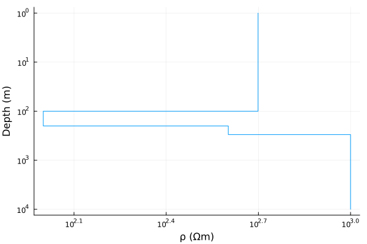

# Model

## Demo
Specifying a model is easy. Let's say you want to add a resistivity distribution with 4 layers as:
* Layer 1: 500 $\Omega m$, thickness= 100 $m$
* Layer 2: 1000 $\Omega m$, thickness= 500 $m$
* Layer 3: 10 $\Omega m$, thickness= 3000 $m$
* Layer 4: 100 $\Omega m$, half-space

Define the model using `model` and you are done.
```julia
using MT
ρ= [500., 100., 400., 1000.];
h= [100., 100., 100.];
m= model(ρ, h)
```
This `model` can then just be passed into `forward` function to get the `response`.

**Note**: 
!!! note 
    Always use `Float64` or `Float32` types while defining the vectors for resistivities and thickness. This is done for performance while not imposing any serious constraints since most of the data is generally processed using `Float64` on most CPUs and `Float32` on most GPUs.

The model can then be plotted using 
```julia
plot_model(m, label= false, max_depth= 1e4)
```


<!-- Make this a live page using Pluto.jl? -->